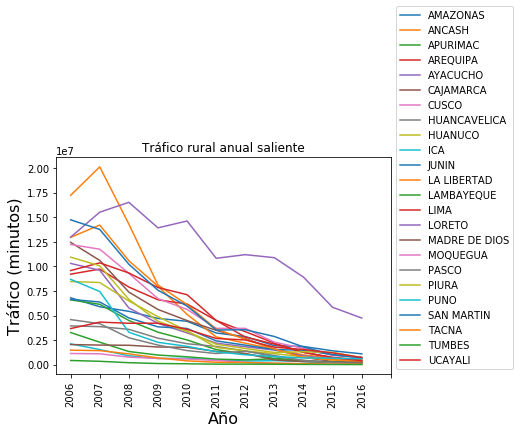
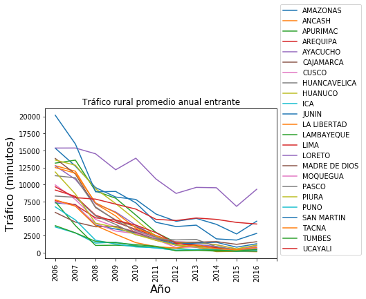
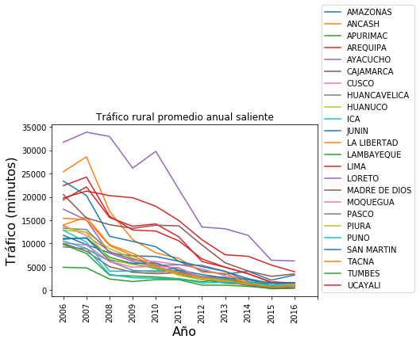
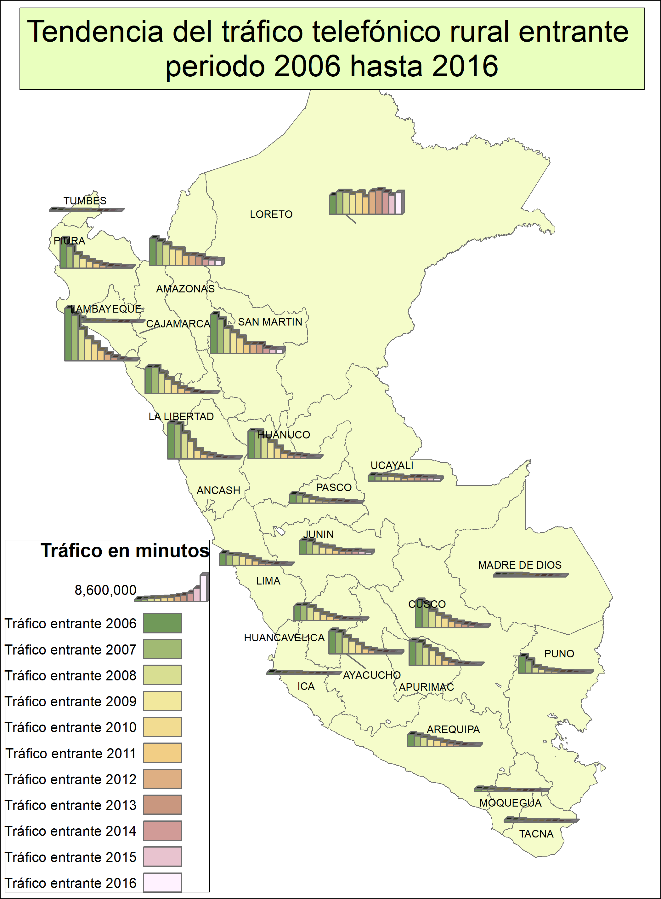
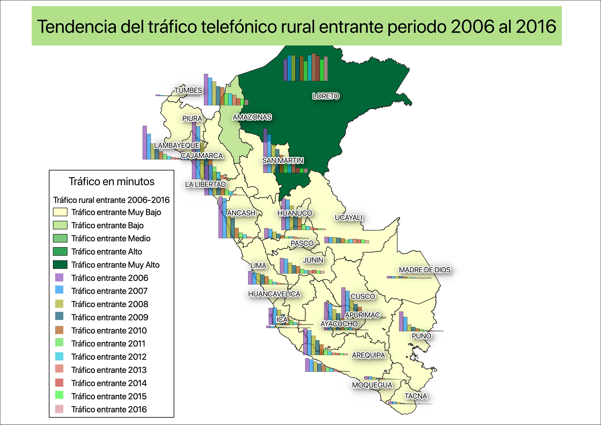
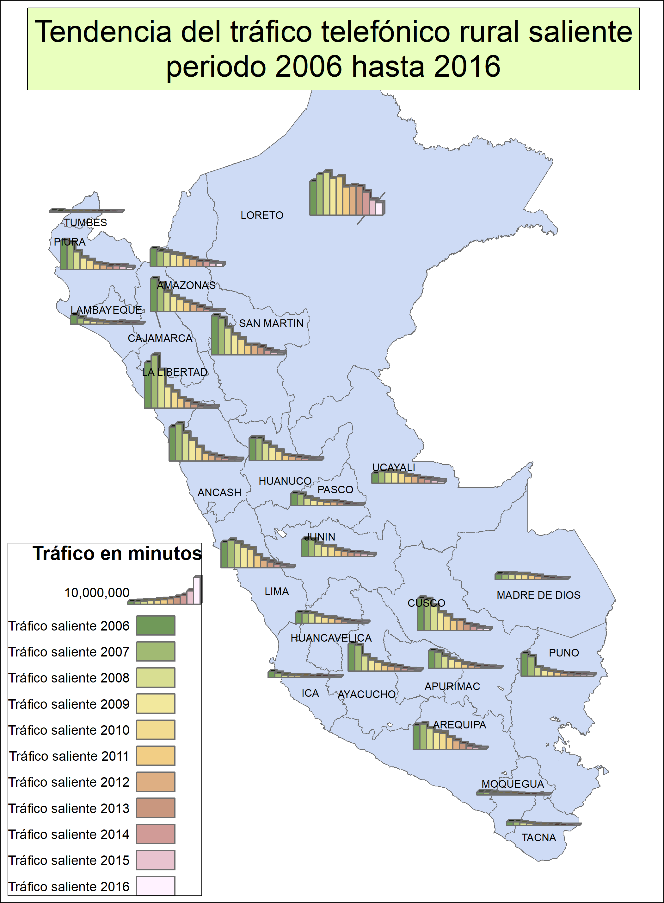
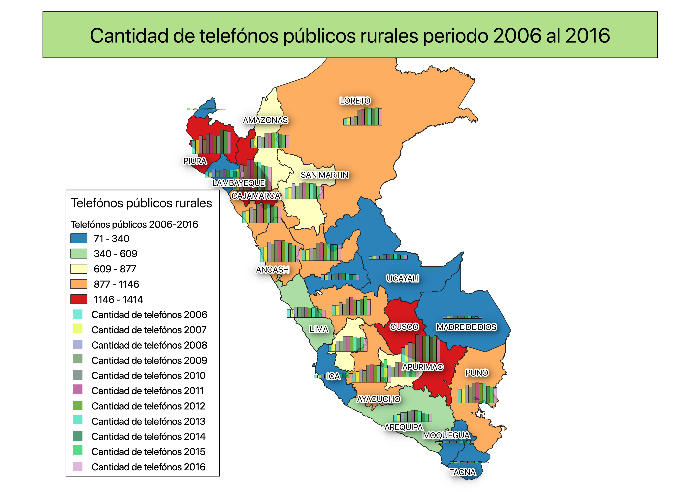
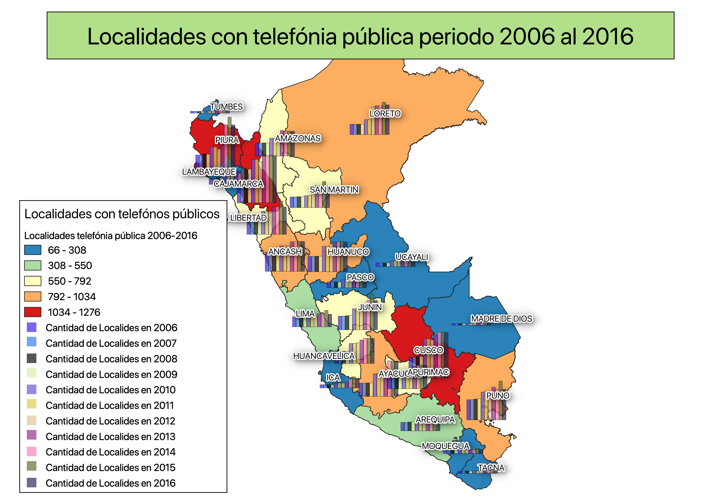
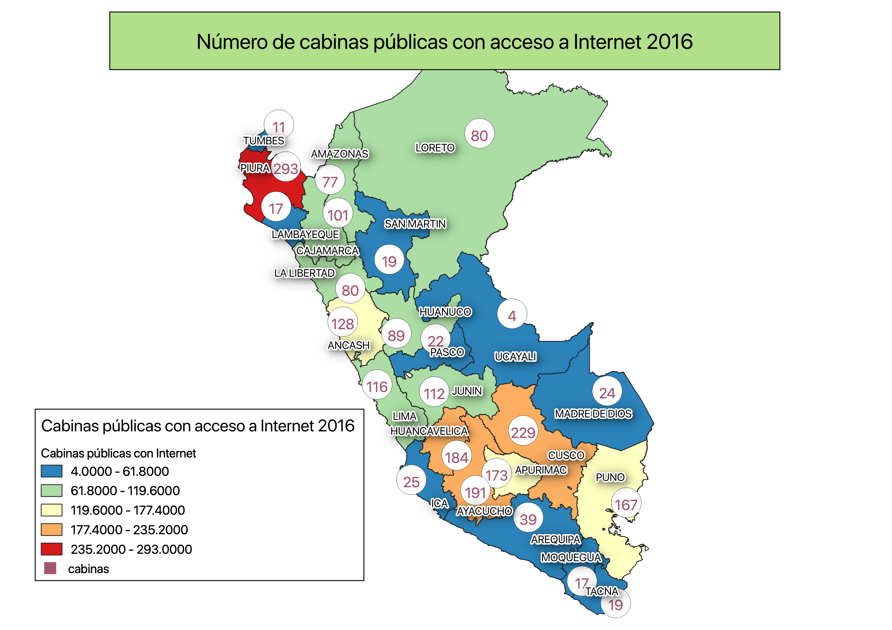

# Graficando comportamiento del tráfico rural en PERÚ

Se toma los datos publicos del tráfico telefónico rural en el Perú y se grafica su comportamiento, en el periodo de 10 años, desde el 2006 hasta el 2016.

La fuente de datos esta disponible, de forma pública y abierta en la siguiente:
* https://www.osiptel.gob.pe/documentos/8-indicadores-de-servicios-de-comunicaciones-rurales

Para este analisis, se tomaron en cuenta los indicadores de servicio de comunicaciones rurales, tales como:

* 8.3_Trafico_anual_entrante_por_departamento.xlsx
* 8.4_Trafico_anual_saliente_por_departamento.xlsx
* 8.5_Trafico_anual_entrante_promedio_por_telefono_y_por_departamento.xlsx
* 8.6_Trafico_anual_Saliente_promedio_por_telefono_y_por_departamento.xlsx

## Tráfico rural anual entrante

## Tráfico rural anual saliente

## Tráfico rural promedio anual entrante

## Tráfico rural promedio anual saliente

De las gráficas vistas arriba sobre el tráfico rural, se puede apreciar una tendencia hacia la disminusión de la intensidad del tráfico telefónico rural, con excepción de algunos casos en los departamentos del oriente del Perú.

La pregunta que nos intereza responder es explicar la razón de este decremento y en el proceso caracterizar del tráfico telefonico rural, en función de dos variables, como son la teledensidad móvil y PBI per capita ambas por departamento, que fueron ampliamente estudiados por otras investigaciones sociales y economicas.

Se explora el comportamiento del tráfico rural a tráves del tiempo y de mapas, que nos ayudan a entender la migración de tráfico ocurrida en los ultimos 10 años.

## Tendencia del tráfico telefónico rural entrante periodo 2006 hasta 2016

## Tendencia del tráfico telefónico rural saliente periodo 2006 hasta 2016

## Cantidad de telefónos públicos rurales periodo 2006 hasta 2016

## Númeoro de localidades beneficiadas con telefónos públicos periodo 2006 hasta 2016

## Cantidad de cabinas con acceso a Internet

2.1 Líneas en servicio por departamento
lineas 2003 a 2018, por departento..., 
nos da una tendencia referencial... 

2.2 Densidad por departamento uhm...
Teleldensidad nacional 2003 a 2012

2.3 Estructura de uso por departamento
Infraestructua en uso desde 2013 al 2019

2.4 Líneas en servicio por empresa
Teledensidad Nacional, no departamento
1994 al 2018

2.5 Líneas en servicio por modalidad y por empresa
01/2001 al 12/2019 , no departamento.  podemos usar la tendencai para 
del 2.1 para continuar con el analisis.

2.6, 2.7 y 2.8 Lineas por tipo de servicio y por departamento
para tener una idea de la distribucion de las lineas moviles 
en las zonas rurales, cabe notar que esto solo es aproximancion
referencial que nos de una idea, como el trafico telefonico movil
logra explicar la disminucion del trafico telefonico rural.

El resto no es releventante en el analisis.

2.9 Tráfico entrante por operador
2.10 Tráfico Originado por Operador

2.15 Número de Mensajes Originados en Terminales de Servicios Móviles

El principal problema de obtener mediciones de trafico telefonico por departamento, es que a partir del 2013, con el cambio de la politica 
de portabilidad numerica todos los departamentos se encuentran dentro 
de una misma zona local LAC, por que se debe realizar el analisis 
respectivo tomando otras fuentes.

Podemos utilizar el trafico total por generado por la telefonia movil, 
y 

Para el analisis de trafico telefonico rural, analizando el decremento en los años y como esto es afectado por el trafico movil en las zonas rurales, tenemos en cuenta que al una distribucion de trafico por departamento, vamos a iniciar el analisis de trafico de forma general es decir para todo el peru, durante el periodo de varios años.